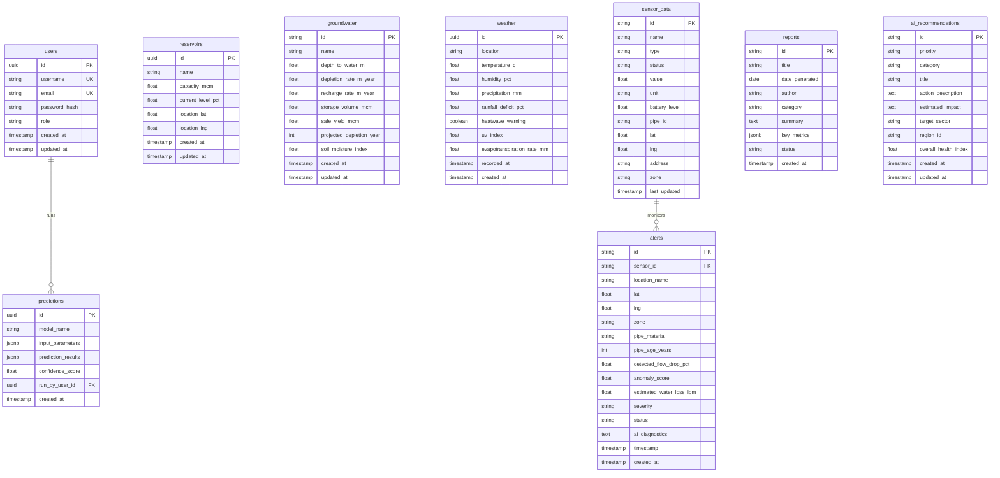

# AquaMind AI - Database Entity Relationship Diagram

This document displays the ER diagram for the AquaMind AI database schema.

```mermaid
erDiagram
    users {
        uuid id PK
        string username UK
        string email UK
        string password_hash
        string role
        timestamp created_at
        timestamp updated_at
    }
    
    reservoirs {
        uuid id PK
        string name
        float capacity_mcm
        float current_level_pct
        float location_lat
        float location_lng
        timestamp created_at
        timestamp updated_at
    }
    
    groundwater {
        string id PK
        string name
        float depth_to_water_m
        float depletion_rate_m_year
        float recharge_rate_m_year
        float storage_volume_mcm
        float safe_yield_mcm
        int projected_depletion_year
        float soil_moisture_index
        timestamp created_at
        timestamp updated_at
    }
    
    weather {
        uuid id PK
        string location
        float temperature_c
        float humidity_pct
        float precipitation_mm
        float rainfall_deficit_pct
        boolean heatwave_warning
        float uv_index
        float evapotranspiration_rate_mm
        timestamp recorded_at
        timestamp created_at
    }
    
    sensor_data {
        string id PK
        string name
        string type
        string status
        float value
        string unit
        float battery_level
        string pipe_id
        float lat
        float lng
        string address
        string zone
        timestamp last_updated
    }
    
    alerts {
        string id PK
        string sensor_id FK
        string location_name
        float lat
        float lng
        string zone
        string pipe_material
        int pipe_age_years
        float detected_flow_drop_pct
        float anomaly_score
        float estimated_water_loss_lpm
        string severity
        string status
        text ai_diagnostics
        timestamp timestamp
        timestamp created_at
    }
    
    predictions {
        uuid id PK
        string model_name
        jsonb input_parameters
        jsonb prediction_results
        float confidence_score
        uuid run_by_user_id FK
        timestamp created_at
    }
    
    reports {
        string id PK
        string title
        date date_generated
        string author
        string category
        text summary
        jsonb key_metrics
        string status
        timestamp created_at
    }
    
    ai_recommendations {
        string id PK
        string priority
        string category
        string title
        text action_description
        text estimated_impact
        string target_sector
        string region_id
        float overall_health_index
        timestamp created_at
        timestamp updated_at
    }

    sensor_data ||--o{ alerts : "monitors"
    users ||--o{ predictions : "runs"
```
